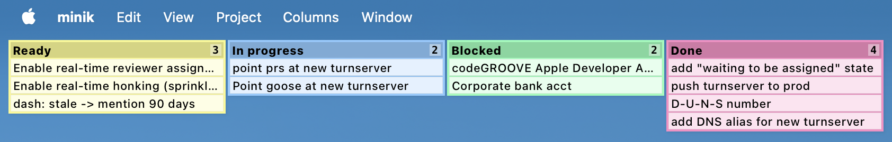

# minik

Native GitHub Kanban boards but tiny. Like _really_ tiny.

Here's the maximized view:



Similar to the macOS Stickies app, here's the minimized view you can see by double-clicking on it:


## What

Inspired by the macOS Stickies app, it's a floating Kanban for your GitHub project boards.

- **Minimalist**: Collapses to a tiny strip when you don't need it
- **Always on top**: Stay on task
- **Native**: Built with Rust & Tauri

## Features

- ✅ Minimized/expanded views
- ✅ Column visibility toggles
- ✅ Drag & drop items between columns
- ✅ Click through to GitHub issues/PRs
- ✅ Uses your existing `gh` CLI auth

## Quick Start

```bash
# Prerequisites: Rust + GitHub CLI
gh auth login
cargo install tauri-cli

# Install it to /Applications
git clone https://github.com/codeGROOVE-dev/minik
cd minik
make install
```

It's only been tested on macOS, but it should work anywhere.

## Why "minik"?

Mini + kanban = minik.

I get distracted easily so I needed something to keep me on task.

## Status

Works better than expected, breaks less than feared. Still rough around the edges but genuinely useful for daily project tracking.

## License

Apache
